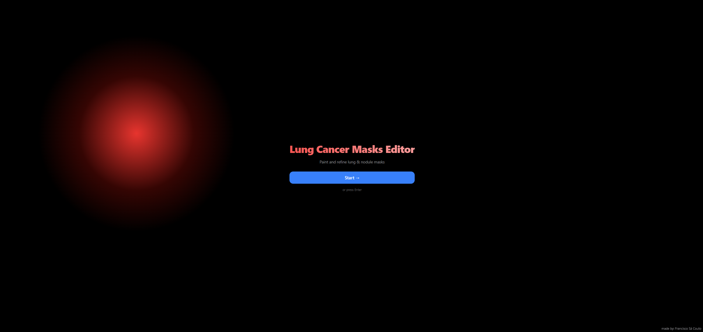
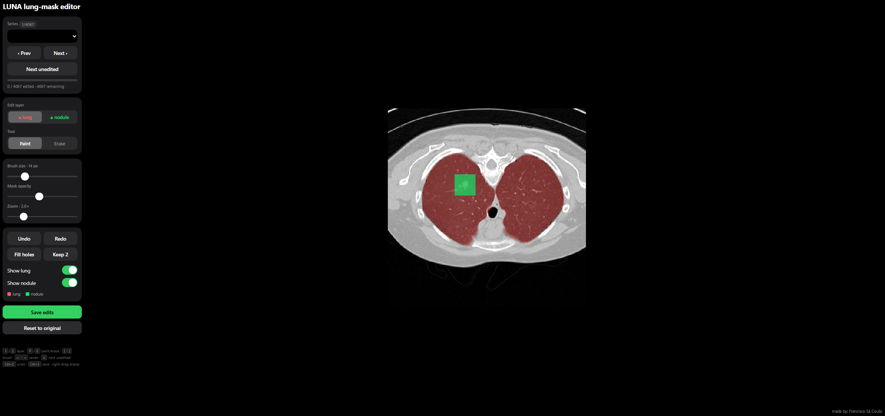

# LUNA25 lung-mask editor


A small local web app to hand-edit LUNA25 lung masks with the mouse. Runs on your own
machine (no SSH/X11): a Flask server serves a canvas you paint on in the browser.

## You need only two things
1. **The script**: `mask_editor.py` (self-contained; the browser UI is embedded).
2. **A series list**: which scans to edit, given as **patient + last5** (the last 5 chars
   of the SeriesInstanceUID). No pids, no mapping file.

The dataset (LUNA25 `protocol_7` staging) is the shared cluster path by default, so on the
cluster you don't pass it. Off-cluster, point `--dataset` at your copy.


## Install & run
```bash
pip install flask numpy pillow scipy      # once
python mask_editor.py --series series_528.csv          # on the cluster
# or your own list:
python mask_editor.py --series myseries.csv --dataset /path/to/protocol_7
# open the printed http://localhost:8000 in your browser
```

## Editing
Two editable layers, distinct colours:
- **🔴 Red** = lung mask, **🟢 Green** = nodule. Choose which the brush edits with the
  **Edit layer** buttons (or keys `1` / `2`).
- Left-drag paints, right-drag erases (or the Erase tool). The final mask is the union of
  both layers.
- Brush size / opacity / zoom sliders, **Undo/Redo**, **Fill holes**, **Keep 2 largest**
  (act on the active layer).
- Keys: `1`/`2` layer, `P`/`E` paint/erase, `[` `]` brush, `←`/`→` prev/next, `Ctrl+Z`,
  `Ctrl+S`.

## Saving (non-destructive, mirrors protocol_7)
Switching series **auto-saves** the current one (or press Save). Originals are never
touched. Edits go to `./mask_edits/` (override with `--out-dir`), series-keyed just like
protocol_7:
- `masks/lung_parenchyma/P<patient>-S<last5>.npy` — edited lung mask (drop-in replacement)
- `masks/lung_nodule/P<patient>-S<last5>.npy` — edited nodule mask
- `images/lung_masked/P<patient>-S<last5>.npy` — `chest * (lung | nodule)`

To apply corrections, copy `mask_edits/masks/lung_parenchyma/` over the dataset's and
re-run `preprocess_protocol_5.py`.
